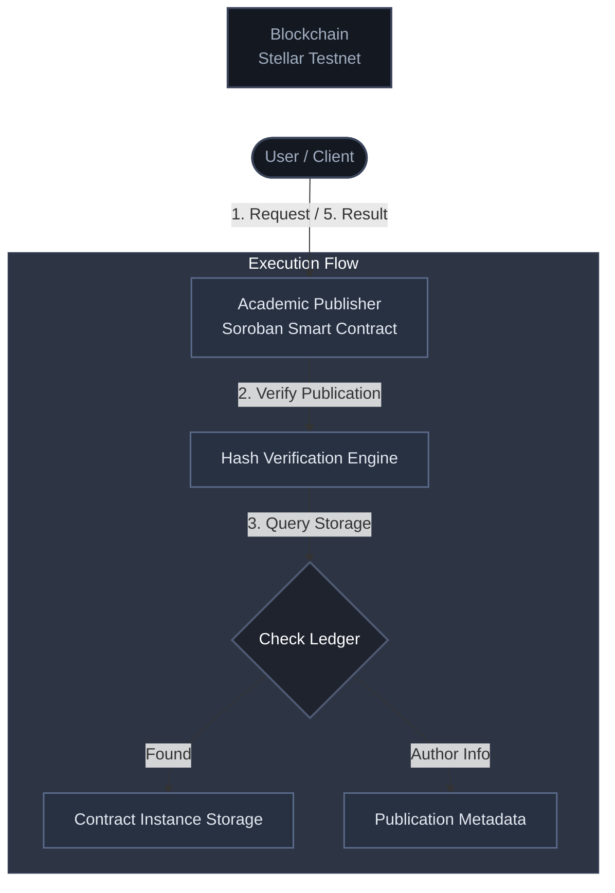

# 🎓 Academic Publishing Platform


The **Academic Publishing Platform** is an institutional-grade, fully decentralized **Soroban smart contract** infrastructure. It empowers researchers, universities, and journals to publish, issue, and verify academic papers and credentials securely on the Stellar blockchain. Every publication is structurally immutable, tamper-proof, and accessible globally.

---

## 📖 What is this?

Traditional academic publishing suffers from high fees, paywalls, and opaque peer-review processes. The Academic Publishing Platform leverages the Stellar network to tokenize and verify academic work, establishing a permanent, fraud-proof registry of scholarly articles and certificates on-chain.

Give it a unique publication hash (e.g., `e3b0c442...`) — it automatically:
- **Validates** the request via the lightning-fast Stellar Soroban network.
- **Verifies** the core existence of the unique document hash on an immutable ledger.
- **Retrieves** authorship and ownership details tied directly to the hash in real-time.
- **Logs** the verification strictly on-chain, guaranteeing 100% auditability.
- **Returns** a definitive valid/invalid status upon blockchain settlement confirmation.

---

## 🔑 Why Soroban?
*The technical backbone for high-performance academic validation*

Traditional blockchains face exorbitant gas fees making mass-publishing unviable. Our switch to **Stellar Soroban** provides:

| Feature | Traditional Chains | 🚀 With Soroban |
| :--- | :--- | :--- |
| **Transaction Fees** | High & Unpredictable | ✅ **Near-Zero & Predictable** |
| **Execution Speed** | Seconds to Minutes | ✅ **Local-speed Sub-second** |
| **Type Safety** | Varies by Language | ✅ **Rust-based Security** |
| **Storage Model** | Expensive/Monolithic | ✅ **Optimized Instance Storage** |
| **Ecosystem** | Fragmented | ✅ **Unified Stellar Network** |

### Core Soroban Capabilities Utilized:
- **`instance()` Storage** — Maintains persistent, highly efficient publication-to-author mappings.
- **SHA256 Hashing** — Uses Soroban’s native native capabilities to secure document fingerprints natively.
- **`symbol_short!()`** — Greatly optimizes on-chain memory footprint.
- **Env SDK** — Enables direct, low-overhead interactions with the global Stellar ledger state.

---

## 🏗️ System Architecture

Our solution is elegantly divided into high-speed on-chain capabilities and flexible off-chain access:

### High-Level Flow



### 1. Smart Contract (On-chain) Flow
The core logic is written cleanly in a Rust Smart Contract (`AcademicPublisher`). It contains three main paths:
- `publish_paper(env, doc_hash, author)`: Permanently locks the unique document hash to the verifiable author.
- `verify_publication(env, doc_hash)`: Queries the on-chain storage to instantly authenticate if a document hash exists.
- `get_author(env, doc_hash)`: Identifies the original publisher/author of a verified document hash.


### 2. Data Structure & Immutability
The platform maps records using Soroban's native `Map<String, String>` directly into the instance storage. This precise design guarantees `O(1)` lookups and absolute mutability resistance.

### 3. Off-Chain Verifier
Institutions generate their own document hashes (SHA-256) via the frontend, ensuring large PDFs or datasets remain completely off-chain, preserving privacy and keeping network usage hyper-optimized.

---

## 🛠️ Tech Stack & Tools

- **Rust**: Lightning-fast core language for the Soroban smart contract.
- **Soroban-SDK**: Fully-featured framework for Stellar contracts.
- **Stellar CLI**: Essential terminal interactions, deployment, and network invocation.
- **Stellar Expert Explorer**: Comprehensive contract tracking and statistical state views.
- **SHA256 Cryptography**: One-way academic document fingerprinting.

---

## 🔗 Deployed Contract

- **Contract Address:** `CDCL2NGXHLTX5B76LAFQZGXNAN6Y46OP4RNIVBHZZOQYL6ESN35O75S6`
- **View on Network:** [Stellar Expert Explorer (Testnet)](https://stellar.expert/explorer/testnet/contract/CDCL2NGXHLTX5B76LAFQZGXNAN6Y46OP4RNIVBHZZOQYL6ESN35O75S6)

### 📸 Smart Contract Dashboard
> *Live activity and on-chain details directly from Stellar Expert:*

[

*(Click to view real-time smart contract data)*

---

## 🎯 Vision & Use Cases

**Our Vision:** Eliminate academic fraud, tear down publishing paywalls, and open a natively verifiable, decentralized hub for global research.

### Core Use Cases:
1. **Academic Papers:** Timestamping discoveries to prove priority logically and permanently.
2. **University Degrees:** Ensuring graduate credentials cannot be forged or purchased.
3. **Peer Review Transparency:** Storing verifiable hashes of peer-review comments and milestones.
4. **Funding Proofs:** Showcasing secure grant allocations linked to immutable research progress.

---

## 🚧 Roadmap & Future Plans

- [ ] **IPFS Integration:** Store full research PDFs directly on IPFS, saving CID reference safely on-chain.
- [ ] **QR Code Verification:** 1-click generation of scannable citations embedding the verification state.
- [ ] **Decentralized Peer Review (DAO):** Tokenize the peer-review process via Stellar assets.
- [ ] **RBAC Security Upgrades:** Enforce institutional-level access controls for designated publishers only.

---

## ⚙️ Environment Setup & Quick Start

### A. Prerequisites
1. **Install Rust:**
   ```bash
   curl --proto '=https' --tlsv1.2 -sSf https://sh.rustup.rs | sh
   ```
2. **Install Soroban CLI:**
   ```bash
   cargo install --locked soroban-cli
   ```
3. **Add WASM Target:**
   ```bash
   rustup target add wasm32-unknown-unknown
   ```

### B. Smart Contract Compilation
Clone the repository:
```bash
git clone https://github.com/AabirManik/AcademicPublishingPlatform.git
cd AcademicPublishingPlatform
```
Build and optimize the contract:
```bash
soroban contract build
soroban contract optimize --wasm target/wasm32-unknown-unknown/release/contract.wasm
```

### C. Deployment & Invocation
Deploy to the Stellar Testnet:
```bash
soroban contract deploy \
  --wasm target/wasm32-unknown-unknown/release/contract.wasm \
  --source <YOUR_ACCOUNT_NAME> \
  --network testnet
```
Publish an academic document hash:
```bash
soroban contract invoke \
  --id CDCL2NGXHLTX5B76LAFQZGXNAN6Y46OP4RNIVBHZZOQYL6ESN35O75S6 \
  --source <SOURCE_ACCOUNT> \
  --network testnet \
  -- publish_paper --doc_hash "sha256_hash_here" --author "Aabir Manik"
```

---

## 👨‍💻 Author

**Aabir Manik**

*Blockchain Developer | Soroban & Stellar Ecosystem Enthusiast*
- **GitHub:** [@AabirManik](https://github.com/AabirManik)
